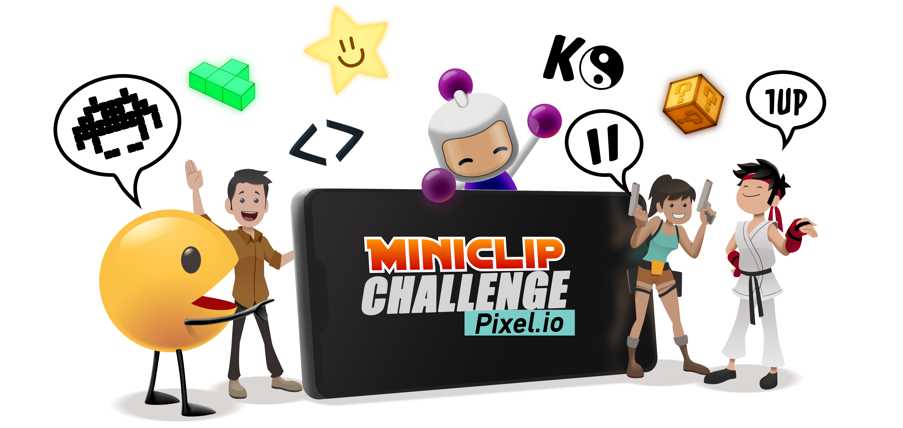

# Miniclip

## Create your pixel.io game

## Context

Hello all.
On Thursday, Friday and Saturday (21 - 23 March 2019), we want to run Pixels Camp v3.0!
“3 days of non-stop tech, talks, workshops and a 48-hour programming competition”.
The main objective is to build up your on own casual, multiplayer, fun, game.

## Details

Hello all.
On Thursday, Friday and Saturday (21 - 23 March 2019), we want to run Pixels Camp v3.0!
“3 days of non-stop tech, talks, workshops and a 48-hour programming competition”

The main objective is to build up your on own casual, multiplayer, fun, game.
If anyone has any questions regarding what constitutes this event, please check the following guidelines:

Core:
Multiplayer Player vs Player  or Player versus environment
Rooms “Arenas” capable of holding all the players in a balanced and fair manner 
Simple/casual immediate gameplay:
Simple controls needing no tutorial
Simple core mechanic (like shooting, eating, pushing)
Nice to have:
Respawn in the same room when you die
Scoreboards
Some progression/ evolution within a “life” (like growing, bigger guns)
Thanks

## Resources

