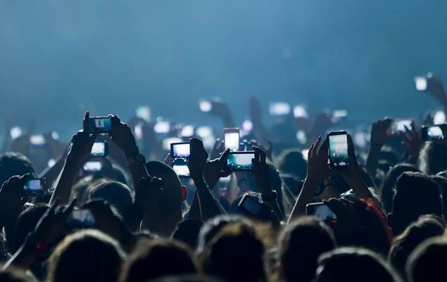

# NOS

## Crowdsourcing Video AI Director!

## Context

A director simulation that change, cut and guides a movie direction based on the video feed of several cameras (an AI director). It should be possible to gather several video feeds of single scene (it can be simulated locally with your smartphone cameras) and change dynamically and automatically between them by video triggers based on volume, zoom or color for instance.
 
(for heroes) The transition between cameras (feeds) can be performed with no cuts, smoothly and continuously, stop in a frame and change it. If you use enough cameras and dispose them properly, you can simulate a 360º experience.

## Details

How it works?
This challenge can be explored in 2 separate components (at least) and merged in the end:
So one of the components is the AI Director, where you should create a director simulation that can alternate, guide, compose and direct a scene between 2 cameras or feeds (at least). You can create an elastic solution to add more cameras or feeds;
Second one, the video transition between 2 feeds or cameras performed in a smooth, continuous and no cuts way, in order to experience a cool immersive motion. It should stop the 2 (or several) feeds at same point (in space) and transfer between them. You can use offline feeds (live is for big bosses). If you dispose several cameras properly you can explore a 360º experience. This is inspired on: https://www.intel.com/content/www/us/en/sports/nfl/overview.html
The high end and final component of the challenge is the merge and mix of the two components above - AI Director with continuous and no cuts transitions
 
Again, a participation can address all the components above or some of them. The third one requires the first two implementation.
 
Use case scenario:
A possible usage of the this solution is in public events like football stadium or music concerts where the crowd can record/stream video on their powerful smartphones and the viewers of this streams can watch in an enhanced (at least cooler and awesome) experience with 360º and AI driven direction.

## Resources

